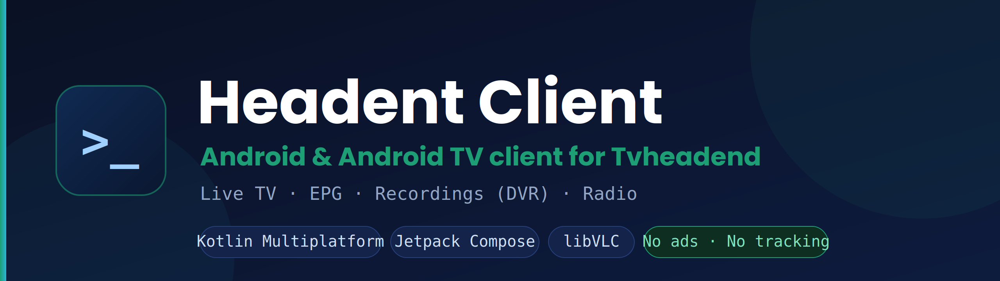

<p align="center">
  
</p>

<p align="center">
  
  
  
  
</p>

# Headent Client

Android client for [Tvheadend](https://tvheadend.org/) — live TV, EPG, recordings (DVR)
and radio, built for **Android TV boxes and phones**. Written in Kotlin Multiplatform with
Jetpack Compose and libVLC.

> **Disclaimer:** Headent Client is an independent client application and is **not** an
> official product of the Tvheadend project. The app contains **no** TV channels or
> media content — it only connects to a Tvheadend server that **you** have access to and
> configure yourself. A running Tvheadend server and valid credentials are required.

## Features

- Live TV from your Tvheadend server (HTTP and HTSP)
- EPG grid (TV guide) with fast scrolling and instant now/next from cache
- Recordings (DVR): playback, resume, and a categorized archive
- Seeking inside recordings and the archive — drag the bar or skip ±10 s (accumulating taps)
- Audio tracks labeled by language (not generic "Track 1 / 2 / 3")
- DVB subtitle support with a dedicated renderer
- Compact, scrollable audio/subtitle picker (tuned for TV remotes)
- Radio channels
- Picons (channel logos)
- Channel switching by number, channel list, zapping
- Optional parental lock with PIN (configurable grace period, scope: channels / settings)
- Multiple servers, backup & restore of settings
- Optimized for Android TV / set-top boxes (D-pad remote) and phones
- Localized into 31 languages (see below)
- No ads, no tracking, no telemetry

## Requirements

- A running [Tvheadend](https://tvheadend.org/) server you have access to
- Android 6.0 (API 23) or newer; Android TV or phone

## Localization

The app and the [project website](https://headentclient.com/) are localized into
**31 languages**:

Arabic, Bengali, Bulgarian, Chinese (Simplified), Croatian, Czech, Dutch, English,
French, German, Greek, Hindi, Hungarian, Indonesian, Italian, Japanese, Korean,
Persian, Polish, Portuguese, Romanian, Russian, Serbian, Slovak, Slovenian, Spanish,
Thai, Turkish, Ukrainian, Urdu, Vietnamese.

Translations are community-assisted; corrections and improvements are welcome via issues
or pull requests.

## Project structure

This is a Kotlin Multiplatform project. The **Android app is the actively developed
client**; an iOS target exists and shares the core but is less complete.

```
shared/        KMP core: API client (Ktor, Basic/Digest auth), models,
               HTSP, DVR classifier, secure storage
androidApp/    Jetpack Compose UI — one APK for phone and Android TV
iosApp/        SwiftUI (work in progress)
```

## Building (Android)

The app is built with Gradle. CI builds run via GitHub Actions on each push.

```
# Debug APK (installable for testing)
gradle :androidApp:assembleDebug

# Release APK (R8/minified)
gradle :androidApp:assembleRelease
```

Release signing reads `keystore.properties` from the project root (not committed). If the
file is absent (e.g. CI), the release build falls back to debug signing so the APK is
still installable for testing.

## Privacy

The app stores connection settings (incl. credentials) only locally on the device and
sends them solely to the Tvheadend server you configure. No data is sent to the developer
or any third party. See the
[Privacy Policy](https://headentclient.com/privacy-policy.html) and
[Terms of Use](https://headentclient.com/terms-of-use.html). Both are also available
in-app under Settings → Information.

## License

Released under the [MIT License](LICENSE).
